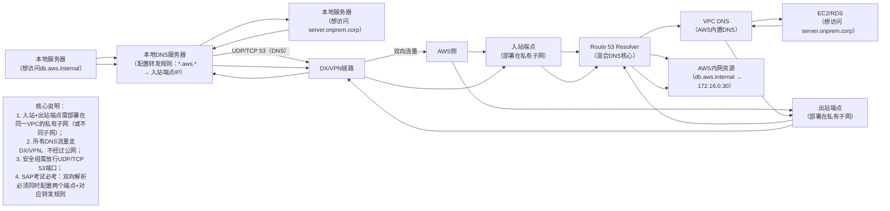

# 混合DNS核心：Route 53 Resolver（出站/入站端点）深度拆解（SAP备考版）
这部分是SAP考试的「高频选择题+架构题考点」，核心就围绕 **Route 53 Resolver的两个端点**，咱们用“通俗场景+流程拆解+架构图+考试陷阱”，把“谁用、怎么用、考什么”讲透，确保你吃透必考知识点！

## 一、先解决核心疑问：为什么必须用Route 53 Resolver？
### 1. 混合环境的DNS痛点（新手必懂）
之前咱们搭好了“本地DC↔AWS”的物理链路（DX/VPN），但还存在一个关键问题：**双方的“名字系统”不互通**：
- 本地服务器（比如10.1.0.10）只认识“自己人”的域名（如server.onprem.corp），不认识AWS的内网域名（如db.aws.internal）——直接访问会提示“找不到服务器”；
- AWS的EC2（比如172.16.0.20）只认识AWS的域名（如s3.amazonaws.com、db.aws.internal），不认识本地的私有域名（如server.onprem.corp）——访问也会失败。

### 2. Route 53 Resolver的定位：混合环境的“DNS翻译官”
Route 53 Resolver是AWS提供的**专用混合DNS解析服务**，相当于在AWS和本地之间架了一座“名字翻译桥”。它的核心能力是：
- 让AWS资源能解析本地私有域名（如server.onprem.corp）；
- 让本地资源能解析AWS内网域名（如db.aws.internal）或AWS公网域名（如api.aws.com）；
- 全程走私有链路（DX/VPN），不经过公网，安全且稳定（这是和公网DNS的核心区别）。

### 3. 为什么不能用其他方案？（SAP考试排除法考点）
- 公网DNS（如8.8.8.8）：不认识本地私有域名（server.onprem.corp）和AWS内网域名（db.aws.internal），解析失败；
- 本地DNS服务器：不认识AWS内网域名，无法转发到AWS的DNS系统；
- AWS默认VPC DNS（VPC内置的DNS服务器）：不认识本地私有域名，无法转发到本地DNS。

→ 结论：**Route 53 Resolver是混合DNS的唯一解决方案**，考试中看到“混合环境DNS互通”直接选它！

## 二、核心考点：两个端点（Outbound/Inbound）拆解（必考！）
Route 53 Resolver通过「两个端点」实现双向解析，这是SAP考试的“重中之重”——不仅考定义，还考“部署位置、流量路径、配置要点”，咱们逐个拆解：

### 1. 出站端点（Outbound Endpoint）：AWS → 本地（“AWS想出去，走Outbound”）
#### ① 核心场景
AWS资源（EC2、Lambda、RDS等）需要访问**本地私有域名**（如server.onprem.corp、db.onprem.corp）时，用这个端点。

#### ② 通俗流程（新手能看懂）
用“找人”比喻：
1. EC2（AWS里的员工）想找“server.onprem.corp”（本地的员工），先喊VPC内置DNS（AWS办公室的前台）；
2. 前台（VPC DNS）不认识这个名字，按预设规则，把“找人请求”交给“出站端点”（AWS派去本地的“信使”）；
3. 信使（出站端点）通过DX/VPN（之前修的路），跑到本地数据中心，把请求交给本地DNS服务器（本地办公室的前台）；
4. 本地前台（本地DNS）认识“server.onprem.corp”，返回它的IP地址（比如10.1.0.10）；
5. 信使（出站端点）带着IP地址原路返回，EC2就能通过IP访问本地服务器了。

#### ③ 技术流程（SAP架构题考点）
`EC2 → VPC DNS → 出站端点 → DX/VPN → 本地DNS服务器 → 本地目标服务器`

#### ④ 关键配置要点（考试常考）
- 部署位置：必须部署在VPC的**私有子网**（不能是公有子网）——因为要通过DX/VPN访问本地，公有子网暴露在公网，不安全且不符合架构最佳实践；
- 安全组：出站端点的安全组需要放行「UDP/TCP 53端口」（DNS协议的默认端口），允许VPC DNS的流量进来，允许到本地DNS的流量出去；
- 规则配置：需要在Route 53 Resolver中创建「转发规则」，指定“所有*.onprem.corp的请求，转发到本地DNS服务器的IP地址”（比如10.0.0.2）。

#### ⑤ 考试陷阱
- 错误选项：“出站端点部署在公有子网”“出站端点用于本地访问AWS域名”；
- 正确选项：“出站端点实现AWS到本地的DNS解析”“出站端点需配置转发规则指向本地DNS”。

### 2. 入站端点（Inbound Endpoint）：本地 → AWS（“本地想进来，找Inbound”）
#### ① 核心场景
本地服务器需要访问**AWS内网域名**（如db.aws.internal、redis.aws.internal）或AWS公网域名（如s3.ap-southeast-1.amazonaws.com）时，用这个端点。

#### ② 通俗流程（新手能看懂）
1. 本地服务器（本地的员工）想找“db.aws.internal”（AWS里的数据库），先喊本地DNS服务器（本地办公室的前台）；
2. 本地前台（本地DNS）不认识这个名字，按预设的“转发规则”，把请求交给“入站端点”的IP地址（AWS在本地设的“收件箱”）；
3. 这个“收件箱”（入站端点）通过DX/VPN（修的路），把请求传给Route 53 Resolver（AWS的“超级前台”）；
4. 超级前台（Route 53 Resolver）认识“db.aws.internal”，返回它的私网IP（比如172.16.0.30）；
5. 结果原路返回给本地服务器，本地就能通过IP访问AWS的数据库了。

#### ③ 技术流程（SAP架构题考点）
`本地服务器 → 本地DNS服务器（配置转发规则） → 入站端点IP → DX/VPN → 入站端点 → Route 53 Resolver → AWS目标资源`

#### ④ 关键配置要点（考试常考）
- 部署位置：同样必须部署在VPC的**私有子网**（和出站端点可以在同一个子网，也可以在不同子网）；
- 安全组：入站端点的安全组需要放行「UDP/TCP 53端口」，允许本地DNS服务器的流量进来；
- 核心配置：本地DNS服务器必须配置「条件转发规则」——指定“所有*.amazonaws.com、*.aws.internal的请求，转发到入站端点的IP地址”（入站端点创建后会生成2个以上IP，需全部配置）。

#### ⑤ 考试陷阱
- 错误选项：“入站端点用于AWS访问本地域名”“入站端点不需要配置到本地DNS的转发规则”；
- 正确选项：“入站端点实现本地到AWS的DNS解析”“本地DNS需配置转发规则指向入站端点IP”。

## 三、架构图：双向DNS解析完整架构（SAP经典考点）
用Mermaid架构图呈现“全双向解析”场景（本地↔AWS互相解析域名），这是考试中最常考的架构：

## 四、两个端点核心差异对比（SAP真题常考维度）
用表格快速区分，做题时直接对照：
| 对比维度         | 出站端点（Outbound Endpoint）       | 入站端点（Inbound Endpoint）         |
|------------------|------------------------------------|--------------------------------------|
| 解析方向         | AWS → 本地（AWS解析本地域名）       | 本地 → AWS（本地解析AWS域名）         |
| 核心用途         | 解决“EC2访问server.onprem.corp”     | 解决“本地服务器访问db.aws.internal”  |
| 转发规则配置位置 | Route 53 Resolver（指向本地DNS IP） | 本地DNS服务器（指向入站端点IP）       |
| 部署位置         | VPC私有子网                        | VPC私有子网                          |
| 端口要求         | UDP/TCP 53（DNS协议）               | UDP/TCP 53（DNS协议）                |
| 考试关键词       | AWS→本地、转发规则、本地DNS IP      | 本地→AWS、条件转发、入站端点IP        |

## 五、SAP备考实战小贴士（新手避坑）
1. 口诀记死：“AWS出去走Outbound，本地进来找Inbound”——做题时看到方向直接对应端点；
2. 架构题必考：双向解析必须“两个端点都配置”，缺一不可（比如题目说“本地能访问AWS，AWS不能访问本地”，大概率是没配出站端点或转发规则）；
3. 部署位置陷阱：两个端点都必须在「私有子网」，选项里出现“公有子网”直接排除；
4. 端口陷阱：DNS协议是UDP/TCP 53端口，考试可能考“安全组需放行哪些端口”，答案就是53端口；
5. 唯一解陷阱：看到“混合DNS互通”，直接选Route 53 Resolver，其他选项（如公网DNS、VPC对等连接）全排除。

## 六、常见场景延伸（帮助理解考点）
1. 场景1：企业只有“本地访问AWS”的需求——只需配置「入站端点」+ 本地DNS转发规则；
2. 场景2：企业只有“AWS访问本地”的需求——只需配置「出站端点」+ Route 53转发规则；
3. 场景3：企业需要“双向访问”（最常见）——必须同时配置两个端点+对应的转发规则（SAP考试默认考这个场景）。

## 总结
混合DNS层的核心是「Route 53 Resolver的两个端点」，记住“方向+配置+部署位置”三个关键点，就能应对所有真题：
- 方向：Outbound（AWS→本地）、Inbound（本地→AWS）；
- 配置：Outbound需在Route 53配转发规则，Inbound需在本地DNS配转发规则；
- 部署：都在私有子网，放行53端口。
