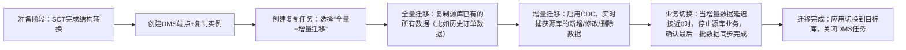

# AWS DMS + SCT 数据库迁移深度拆解（SAP考点进阶版）

**SCT具体“翻译”什么、DMS怎么“搬运”（全量+增量）、CDC的底层逻辑、以及更多SAP考试的细节陷阱**，结合实操流程和真题场景，确保你不仅懂“是什么”，还懂“为什么”“怎么考”！

## 一、先重申核心逻辑（备考必背）
所有考点都围绕这个核心展开：  
**异构迁移 = SCT（结构转换） + DMS（数据传输）；同构迁移 = 仅DMS（无需SCT）**  
- 没有SCT：异构数据库的“语法不通”（比如Oracle的`SEQUENCE` vs MySQL的`AUTO_INCREMENT`），迁移后应用报错；  
- 没有DMS：数据无法从源库搬到目标库，SCT只给“结构蓝图”，不给“实际数据”。

## 二、深入AWS SCT：不止是“表结构转换”，更是“语法翻译官”
SCT（Schema Conversion Tool）的核心是“解决异构数据库的‘语言差异’”，考试不仅考“它做结构转换”，更考“转换什么、不转换什么、怎么处理不兼容”。

### 1. SCT的3层转换（从“骨架”到“肌肉”）
| 转换层级       | 具体内容（通俗版）                          | 考点示例（SAP真题常考）                          |
|----------------|---------------------------------------------|-------------------------------------------------|
| ① 基础结构转换 | 表、列、数据类型、主键/外键、索引、视图       | Oracle的`DATE`类型 → Aurora MySQL的`DATETIME`； Oracle的`NUMBER(10)` → Aurora PostgreSQL的`INTEGER` |
| ② 高级对象转换 | 存储过程、函数、触发器、存储过程、包（Package） | Oracle的`PL/SQL`存储过程 → MySQL的`SQL/PSM`存储过程； SQL Server的`IDENTITY` → Aurora的`AUTO_INCREMENT` |
| ③ 语义适配转换 | 自定义函数、查询语句语法修正、权限/角色映射   | Oracle的`CONNECT BY`树形查询 → MySQL的`WITH RECURSIVE`； DB2的`FETCH FIRST 10 ROWS ONLY` → RDS SQL Server的`TOP 10` |

### 2. SCT的“能力边界”（考试高频陷阱！）
SCT不是“万能翻译官”，有些内容无法自动转换，需要手动调整——这是SAP考试的“细节考点”：
- ✅ 能自动转换：大部分基础结构（表、列、索引）、标准SQL语法的存储过程/函数；
- ❌ 不能自动转换（需手动优化）：
  1. 数据库专属的高级特性（比如Oracle的`Advanced Queuing`、SQL Server的`CLR函数`）；
  2. 复杂业务逻辑的存储过程（比如嵌套多层的`IF-ELSE`、动态SQL）；
  3. 第三方工具依赖的对象（比如Oracle的`GoldenGate`相关配置）；
- 📌 考点提醒：真题会问“下列哪项需要手动调整SCT转换结果？”，选项中出现“复杂存储过程”“数据库专属高级特性”就是正确答案。

### 3. SCT的关键操作（理解流程，应对架构题）
1. 连接源库和目标库（比如Oracle → Aurora MySQL）；
2. 扫描源库的Schema（数据库结构）；
3. 自动生成“转换报告”：标注哪些能自动转换、哪些需要手动调整；
4. 执行结构转换：将转换后的Schema部署到目标库（比如在Aurora中创建对应的表、索引）；
5. 手动优化：修改无法自动转换的存储过程/函数，确保语法兼容。

## 三、深入AWS DMS：不止是“数据搬运”，更是“零停机保障”
DMS（Database Migration Service）的核心是“安全、高效搬运数据”，考试重点考“全量+增量的流程”“CDC的原理”“端点配置”。

### 1. DMS的核心组件（理解组件，应对选择题）
- **端点（Endpoint）**：源端点（连接源数据库，比如Oracle）+ 目标端点（连接目标数据库，比如Aurora）；  
  考点：端点需要配置“数据库类型、连接地址、端口、账号密码”，支持的数据库类型（考试会问“DMS是否支持XX数据库”，比如支持Oracle、MySQL、SQL Server、DB2，不支持Access等桌面级数据库）；
- **复制实例（Replication Instance）**：DMS的“搬运工具”，一台EC2实例，负责读取源库数据、写入目标库；  
  考点：复制实例的规格决定迁移速度（规格越高，带宽/CPU越强，迁移越快），需要部署在能同时访问源库和目标库的网络（比如公有子网访问公网数据库，私有子网访问VPC内数据库）；
- **复制任务（Replication Task）**：定义“搬运规则”——迁移哪些表、全量+增量还是仅全量、是否启用CDC。

### 2. 全量迁移+增量迁移（CDC）的完整流程（SAP架构题必考！）
用“搬家”场景再细化：

#### 关键考点：CDC的底层逻辑（通俗版）
CDC（Change Data Capture）不是“实时查询源库”，而是通过更高效的方式捕获变更：
- 对于支持日志的数据库（Oracle的Redo Log、MySQL的Binlog、SQL Server的Transaction Log）：DMS直接读取数据库的事务日志，不影响源库性能；
- 对于不支持日志的数据库：DMS通过“触发器”捕获变更（性能影响较大，考试中通常不考这种场景）；
- 核心优势：实现“零停机”——业务在迁移过程中正常运行，仅在最后切换时需要极短时间（分钟级）的停机（甚至不停机）。

### 3. DMS的迁移模式（考试选择题考点）
| 迁移模式       | 适用场景                          | 考试关键词                          |
|----------------|-----------------------------------|-------------------------------------|
| 仅全量迁移     | 源库可以停机（比如测试环境迁移）  | 停机迁移、测试环境、快速迁移        |
| 全量+增量迁移  | 源库不能停机（比如生产环境迁移）  | 零停机、生产环境、CDC               |
| 仅增量迁移     | 已完成全量迁移，后续仅同步变更    | 数据同步、灾备场景                  |

### 4. DMS的容错能力（考试陷阱）
- 考点：DMS支持“断点续传”——网络中断、复制实例故障后，重启任务会从断点继续迁移，不会重新全量迁移；
- 错误选项：“DMS网络中断后需要重新执行全量迁移”“CDC不支持断点续传”；
- 正确选项：“DMS支持断点续传，迁移中断后可恢复”“CDC通过读取数据库事务日志实现高效变更捕获”。

## 四、同构迁移vs异构迁移（详细对比表，真题速查）
| 对比维度         | 同构迁移（比如MySQL→RDS MySQL）                | 异构迁移（比如Oracle→Aurora MySQL）                | 考试考点                          |
|------------------|------------------------------------------------|---------------------------------------------------|-----------------------------------|
| 结构转换需求     | 不需要SCT（源库和目标库语法一致）              | 必须SCT（语法不一致，需转换）                      | 异构迁移=SCT+DMS，同构=仅DMS      |
| DMS配置难度     | 低（端点类型相同，无需适配）                    | 中（端点类型不同，需配置适配参数）                  | 异构迁移需要在SCT中解决语法兼容问题 |
| 迁移速度         | 快（无结构转换开销）                            | 慢（需先做SCT转换和手动优化）                      | 同构迁移比异构迁移更高效          |
| 常见场景         | 本地MySQL迁移到RDS MySQL、RDS SQL Server迁移到另一Region的RDS SQL Server | 本地Oracle迁移到Aurora、DB2迁移到RDS SQL Server | 考试默认考异构迁移，优先选SCT+DMS |

### 真题示例：
某企业计划将生产环境的Oracle 19c数据库零停机迁移到Amazon Aurora PostgreSQL，以下方案正确的是？
- 选项A：直接创建DMS任务，选择全量+增量迁移；
- 选项B：先用SCT转换Oracle的表结构和存储过程，再用DMS做全量+增量迁移，启用CDC；
- 选项C：用SCT直接迁移数据，无需DMS；
- 选项D：用DataSync迁移数据库文件，再用SCT转换结构。
- 答案：B（解析：异构迁移必须SCT+DMS，零停机需要CDC）。

## 五、新增考试陷阱（之前没覆盖的细节）
1. 错误选项：“SCT可以迁移数据”“DMS可以自动转换Oracle的存储过程到MySQL”“CDC需要停止源库业务才能启用”；
2. 正确选项：“SCT仅转换结构，不迁移数据”“DMS的复制实例需要部署在能访问源库和目标库的网络”“CDC通过读取数据库事务日志捕获变更，不影响源库性能”；
3. 延伸陷阱：“DMS支持将Access数据库迁移到RDS”（错误，Access是桌面级数据库，DMS不支持）；“SCT转换后的存储过程无需手动调整”（错误，复杂存储过程需要手动优化）。

## 六、备考总结（进阶必记）
1. SCT的核心：**结构转换+语法适配**，复杂对象需手动调整；
2. DMS的核心：**端点+复制实例+复制任务**，CDC依赖数据库事务日志，实现零停机；
3. 流程口诀：“先SCT转结构，再DMS搬数据（全量+增量），最后切业务”；
4. 真题技巧：看到“异构”“零停机”→ 选SCT+DMS+CDC；看到“同构”“测试环境”→ 选仅DMS；看到“复杂存储过程”→ 选“需要手动调整SCT转换结果”。
