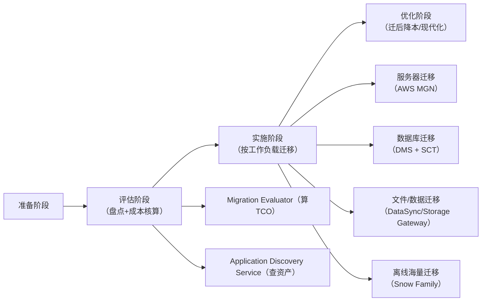

# 迁移与现代化（Migration & Modernization）深度拆解（SAP备考版）
这一模块是SAP考试的「高频应用场景题考点」——核心逻辑是**“先评估，再实施”**，考试重点考“不同阶段用什么工具”“不同工作负载（服务器/数据库/文件）选什么方案”“工具的核心差异与陷阱”。咱们用“搬家”的通俗逻辑串联全流程，再逐个拆解工具的“角色+考点+场景+陷阱”，确保新手也能吃透！

## 一、先建立核心认知：迁移全流程=“评估阶段+实施阶段”
把迁移想象成「企业搬家」：
- 评估阶段=“盘点家产+算搬家成本”：搞清楚现有IT资产（服务器、数据库、文件）的情况，对比“继续用现有环境”和“迁到AWS”的成本（TCO），做商业论证；
- 实施阶段=“分门别类搬东西”：按资产类型（服务器、数据库、文件）选对应的“搬家工具”，确保迁移过程快、停机时间短、数据不丢失。

### 迁移全流程阶段划分（SAP考试必考框架）

## 二、评估阶段：盘点家产+算清成本（2个核心工具）
评估阶段的目标是「摸清现状、说服决策」，考试考“工具的适用场景+核心特性”，不会考复杂配置。

### 1. Migration Evaluator（原TCO计算器）—— “搬家成本核算师”
#### 核心角色
评估阶段的「商业论证工具」：帮企业算“迁到AWS后能省多少钱”，生成TCO（总拥有成本）报告，用于向管理层申请预算。

#### 关键考点（SAP必考）
- 数据收集方式：**无代理（Agentless）** ——不需要在现有服务器/数据库上装任何软件，通过API（比如VMware vCenter API）或云厂商接口收集数据，不影响现有业务；
- 收集内容：服务器规格（CPU/内存/存储）、性能数据（CPU利用率、IOPS）、现有IT支出（硬件采购、运维成本、电费）；
- 输出结果：TCO对比报告（比如“迁到AWS后3年能省50%成本”）、推荐的AWS目标架构（比如“现有VMware虚拟机对应AWS EC2哪种实例”）。

#### 考试陷阱
- 错误选项：“Migration Evaluator需要安装代理收集数据”“Migration Evaluator负责数据迁移”；
- 正确选项：“Migration Evaluator是评估阶段工具，生成TCO报告用于商业论证”“Migration Evaluator支持无代理数据收集”。

### 2. Application Discovery Service（ADS）—— “搬家家产盘点员”
#### 核心角色
评估阶段的「资产发现工具」：比Migration Evaluator更细致，不仅盘点“有哪些服务器/数据库”，还能收集应用的依赖关系（比如“APP服务器依赖Oracle数据库”），为迁移方案设计提供依据。

#### 关键考点（SAP高频对比题）
核心考点是 **Agentless（无代理）vs Agent-based（有代理）** 的区别，必须记死：

| 对比维度         | Agentless（无代理）                | Agent-based（有代理）                |
|------------------|-----------------------------------|--------------------------------------|
| 适用环境         | 仅支持VMware环境（vCenter管理）    | 支持物理机、所有类型虚拟机（VMware/KVM/Xen）、云服务器 |
| 数据收集深度     | 浅：仅收集服务器规格、基本性能数据 | 深：收集进程级依赖（比如“Tomcat进程依赖MySQL端口3306”）、精确性能数据（CPU/内存实时利用率）、软件安装清单 |
| 部署复杂度       | 低：通过vCenter API对接，无需改动现有环境 | 高：需要在每台服务器上安装代理程序 |
| 考试关键词       | VMware、快速发现、数据少           | 物理机、进程依赖、精确数据           |

#### 考试陷阱
- 错误选项：“ADS的Agentless模式支持物理机”“Agent-based模式不需要安装代理”；
- 正确选项：“ADS用于迁移前的应用发现，Agent-based模式收集数据更详细”“Agentless模式仅适用于VMware环境”。

## 三、实施阶段：按工作负载选工具（核心迁移工具拆解）
实施阶段是考试的「重中之重」——真题会直接问“某企业要迁移XX资产，选什么工具？”，核心是按“服务器、数据库、文件、离线海量数据”分类记忆。

### 1. 服务器迁移：AWS MGN（Application Migration Service）—— “服务器搬家首选车”
#### 核心角色
实施阶段「服务器迁移的默认首选工具」：主打“Lift-and-shift（直接迁移/平移）”，即把现有服务器（物理机/VMware/KVM等）原样迁到AWS EC2，不修改应用代码，停机时间最短。

#### 关键考点（SAP必考）
- 迁移方式：**块级复制**——只复制服务器磁盘的“变化部分”（增量复制），不是全量复制，迁移速度快，停机时间短（分钟级）；
- 适用场景：所有服务器类型（物理机、虚拟机、云服务器），无论操作系统（Windows/Linux）；
- 核心优势：无需重新配置服务器，迁后EC2实例与原服务器“一模一样”，应用无需适配；
- 对比其他工具：之前的AWS Server Migration Service（SMS）已被MGN替代，考试中选MGN即可（错误选项会出现SMS，直接排除）。

#### 考试陷阱
- 错误选项：“MGN仅支持虚拟机迁移”“MGN是文件级迁移工具”“SMS比MGN更适合服务器迁移”；
- 正确选项：“MGN是服务器Lift-and-shift迁移的首选，支持块级增量复制”“MGN支持物理机和虚拟机迁移”。

### 2. 数据库迁移：AWS DMS + AWS SCT —— “数据库搬家黄金组合”
#### 核心角色
实施阶段「数据库迁移的专属工具」：两者必须配合使用，SCT负责“格式转换”，DMS负责“数据搬运”，支持异构数据库迁移（比如Oracle→Aurora、SQL Server→RDS）。

#### 关键考点（SAP高频综合题）
##### ① 分工明确（必考！）
- AWS SCT（Schema Conversion Tool）：“翻译官”——负责**异构数据库的结构转换**（比如Oracle的表结构、存储过程→Aurora MySQL的表结构、存储过程），解决“语法不兼容”问题；
  - 注意：SCT只做“结构转换”，不搬运数据；
- AWS DMS（Database Migration Service）：“搬运工”——负责**数据传输**（全量数据+增量数据），核心特性是**CDC（Change Data Capture，变更数据捕获）** ：
  - 全量迁移：迁移现有数据库的所有历史数据；
  - 增量迁移：通过CDC捕获源数据库的实时变更（增删改），同步到目标数据库，最终实现**零停机迁移**（业务不停机，数据实时同步，切换时几乎无感知）。

##### ② 适用场景
- 同构迁移：MySQL→RDS MySQL（无需SCT，仅用DMS即可，但考试中通常考异构迁移）；
- 异构迁移：Oracle→Aurora、SQL Server→Aurora PostgreSQL、DB2→RDS SQL Server（必须SCT+DMS）。

#### 考试陷阱
- 错误选项：“DMS可以直接实现Oracle到Aurora的异构转换”“SCT负责数据搬运”“CDC只能用于全量迁移”；
- 正确选项：“数据库异构迁移需SCT做结构转换+DMS做数据传输”“DMS的CDC功能支持零停机迁移”“SCT不搬运数据，仅转换数据库结构”。

### 3. 文件/数据迁移：DataSync + Storage Gateway —— “在线数据搬运工”
#### 3.1 AWS DataSync —— “高速文件迁移工具”
##### 核心角色
实施阶段「在线文件迁移的首选」：专门用于NFS/SMB协议的文件数据（比如本地文件服务器、NAS存储）迁移到AWS的S3/EFS/FSx for Windows File Server。

##### 关键考点
- 迁移优势：比手动脚本快10倍，自带数据校验（确保迁移后数据不丢失）、断点续传（网络中断后无需重新迁移）；
- 适用场景：本地文件服务器→S3（备份）、本地NAS→EFS（云上共享文件）、SMB文件→FSx（Windows环境文件共享）；
- 传输方式：在线传输（走公网或DX专线），适合带宽充足的场景。

##### 考试陷阱
- 错误选项：“DataSync支持数据库迁移”“DataSync只能迁移到S3”“DataSync没有数据校验功能”；
- 正确选项：“DataSync适用于NFS/SMB文件迁移到S3/EFS/FSx”“DataSync比手动脚本迁移更快，带数据校验”。

#### 3.2 AWS Storage Gateway —— “混合存储/缓存工具”
##### 核心角色
「混合存储场景+缓存迁移」：不是单纯的“一次性迁移工具”，更多用于“本地与AWS存储长期联动”，也可用于缓慢迁移（比如日常缓存数据到AWS，逐步替代本地存储）。

##### 关键考点（三种网关类型，SAP必考！）
必须区分三种网关的用途，真题常考“某场景选哪种网关”：

| 网关类型       | 核心用途                          | 本地访问方式 |  AWS目标存储       | 考试关键词                |
|----------------|-----------------------------------|--------------|---------------------|---------------------------|
| File Gateway   | 本地通过SMB/NFS访问AWS S3         | SMB/NFS协议  | S3（标准/智能分层） | 本地文件共享→S3、缓存访问 |
| Volume Gateway | 本地通过iSCSI访问块存储，缓存热点数据 | iSCSI协议    | EBS快照（备份）     | 块存储缓存、灾备备份      |
| Tape Gateway   | 替代本地物理磁带库，做长期备份    | iSCSI VTL    | S3 Glacier（归档）  | 磁带备份、合规归档        |

##### 考试陷阱
- 错误选项：“File Gateway支持访问EFS”“Volume Gateway是文件存储”“Tape Gateway用于实时数据迁移”；
- 正确选项：“File Gateway允许本地通过SMB访问S3”“Volume Gateway提供iSCSI块存储缓存”“Tape Gateway用于替代物理磁带库，做长期归档备份”。

### 4. 离线海量迁移：Snow Family —— “离线数据搬家卡车”
#### 核心角色
实施阶段「带宽不足时的海量数据迁移工具」：当本地带宽极低（比如偏远地区），在线迁移TB/PB级数据需要数月时，用物理设备离线迁移。

#### 关键考点（三种设备对比，SAP必考！）
| 设备类型       | 适用场景                          | 容量范围       | 核心特性                          | 考试关键词                |
|----------------|-----------------------------------|----------------|-----------------------------------|---------------------------|
| Snowball Edge  | 企业级海量迁移（TB/PB级）         | 80TB/100TB     | 支持计算功能（边缘计算）、加密传输 | 大规模离线迁移、边缘计算  |
| Snowcone       | 小规模迁移/边缘场景（偏远地区）   | 8TB/14TB       | 便携（手掌大小）、低功耗          | 边缘迁移、小规模离线数据  |
| Snowmobile     | 超大规模迁移（EB级，1EB=1024PB）  | 100PB/车       | 半挂卡车运输，AWS专人押运         | 超大规模数据、EB级迁移    |

##### 考试陷阱
- 错误选项：“Snowcone适合PB级数据迁移”“Snowball Edge不支持加密”“Snowmobile是在线迁移工具”；
- 正确选项：“带宽不足时优先用Snow Family做离线迁移”“Snowball Edge支持边缘计算和加密传输”“Snowmobile用于EB级超大规模数据迁移”。

## 四、核心工具场景对比表（SAP真题速查）
| 工作负载类型   | 迁移场景                          | 推荐工具                          | 考试排除项                          |
|----------------|-----------------------------------|-----------------------------------|-----------------------------------|
| 服务器         | Lift-and-shift迁移（物理机/VM）   | AWS MGN                           | AWS SMS、DataSync                  |
| 数据库         | 异构迁移（Oracle→Aurora）+ 零停机 | SCT + DMS（CDC）                  | DataSync、MGN、Snowball            |
| 文件           | NFS/SMB文件→S3/EFS/FSx（带宽充足）| AWS DataSync                      | SCT、Tape Gateway                  |
| 混合存储       | 本地实时访问S3文件                | File Gateway                      | Volume Gateway、DataSync           |
| 离线数据       | 带宽不足，TB/PB级数据迁移         | Snowball Edge                     | DataSync、DMS                      |
| 边缘场景       | 偏远地区小规模数据迁移+边缘计算   | Snowcone                          | Snowmobile、Snowball Edge          |
| 备份归档       | 替代本地磁带库，长期合规备份      | Tape Gateway                      | File Gateway、DataSync             |

## 五、SAP真题示例（直接套用知识点）
### 真题1：某企业计划将本地VMware环境迁移到AWS，需要先评估迁移后的TCO，且不想在现有VM上安装代理，以下工具组合正确的是？
- 选项A：Migration Evaluator + ADS（Agentless模式）；
- 选项B：Migration Evaluator + ADS（Agent-based模式）；
- 选项C：DMS + SCT；
- 选项D：DataSync + Snowball。
- 答案：A（解析：评估阶段用Migration Evaluator算TCO，ADS的Agentless模式支持VMware无代理发现）。

### 真题2：某企业要将Oracle数据库零停机迁移到Amazon Aurora MySQL，以下哪项是正确的方案？
- 选项A：直接使用AWS DMS进行迁移；
- 选项B：使用AWS SCT转换表结构，AWS DMS通过CDC同步数据；
- 选项C：使用AWS DataSync迁移数据库文件；
- 选项D：使用AWS MGN进行Lift-and-shift迁移。
- 答案：B（解析：异构数据库迁移需SCT做结构转换，DMS的CDC实现零停机）。

### 真题3：某企业本地文件服务器（SMB协议）需要迁移到AWS，要求迁移速度快、数据不丢失，且带宽充足，应选择哪种工具？
- 选项A：Snowball Edge；
- 选项B：AWS DataSync；
- 选项C：File Gateway；
- 选项D：AWS DMS。
- 答案：B（解析：SMB文件迁移，带宽充足，DataSync是首选，File Gateway是混合存储，不是一次性迁移工具）。

## 六、备考总结（新手必记）
1. 阶段划分口诀：“评估用Evaluator（算TCO）+ ADS（查资产），实施按负载选工具”；
2. 核心组合记死：“数据库异构迁移=SCT+DMS（CDC零停机），服务器迁移=MGN，文件在线迁移=DataSync，离线迁移=Snow Family”；
3. 陷阱题重点：ADS的Agentless仅支持VMware、DMS不能单独做异构迁移、Storage Gateway的三种类型用途、Snow Family的容量分级；
4. 做题技巧：看到“零停机”→ 选DMS（CDC）；看到“VMware无代理”→ ADS（Agentless）；看到“带宽不足”→ Snow Family；看到“文件迁移（NFS/SMB）”→ DataSync。
