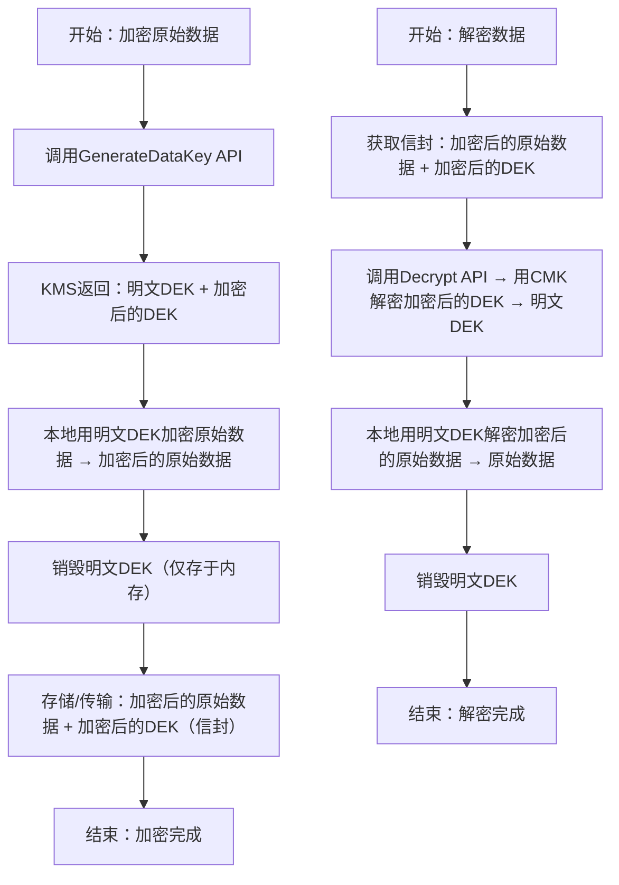

# KMS 终极备考指南：SAP核心考点精解+零基础落地计划
以下结合你整理的「考点总结+学习建议」，进行 **考点深挖+实操拆解+考试应用**，帮你把零散考点串联成“得分体系”，同时让零基础也能按步骤落地学习，直击SAP考试得分点：


## 一、SAP考试KMS核心考点总结（必背+详解）
这部分是KMS模块的“精华浓缩”，直接对应考试80%的题型（单选、多选、场景题），每个考点都补充「考试权重+应用场景+避坑技巧」：

### （一）原理类：信封加密流程（必考，占比15%）
#### 核心考点：流程步骤+API对应+考试陷阱
信封加密是KMS的底层逻辑，考试常考“步骤排序”“API匹配”“存储内容”，必须做到“闭眼能默写”：
1. **加密流程（3步+对应API）**：
   - 第1步：调用 `GenerateDataKey` API → KMS返回「明文DEK + 加密后的DEK」（核心考点：KMS不加密原始数据，只生成DEK）；
   - 第2步：本地用「明文DEK」加密原始数据（大文件/小文件均可，CMK不参与）→ 得到「加密后的原始数据」；
   - 第3步：存储/传输「加密后的原始数据 + 加密后的DEK」→ 这就是“信封”（两者必须绑定存储，缺一不可）。
2. **解密流程（3步+对应API）**：
   - 第1步：获取「加密后的原始数据 + 加密后的DEK」；
   - 第2步：调用 `Decrypt` API → 用CMK解密「加密后的DEK」→ 得到「明文DEK」（核心考点：明文DEK仅在内存中存在，用完立即销毁）；
   - 第3步：本地用「明文DEK」解密「加密后的原始数据」→ 得到原始数据。

#### 考试陷阱（必记）：
- ❌ 误区：“信封加密需要把原始数据上传到KMS”→ 错！原始数据始终在用户侧加密/解密，KMS仅处理DEK；
- ❌ 误区：“存储时只需要保存加密后的原始数据”→ 错！必须同时保存加密后的DEK，否则无法解密；
- ✅ 必记：3个核心API（`GenerateDataKey`生成DEK、`Encrypt`加密小数据、`Decrypt`解密密文）。

#### 真题示例（步骤排序题）：
**题目**：以下哪项是信封加密的正确流程？（ ）  
A. 加密原始数据→调用`GenerateDataKey`→存储信封  
B. 调用`GenerateDataKey`→加密原始数据→存储信封  
C. 调用`Decrypt`→加密原始数据→存储信封  
D. 调用`GenerateDataKey`→调用`Decrypt`→存储信封  
**答案**：B  
**解析**：核心顺序是“生成DEK→用DEK加密数据→存储信封”，A颠倒步骤，C、D混淆加密/解密API。


### （二）选型类：场景→服务精准匹配（必考，占比40%）
这是KMS模块最高频的题型（SAP考试每10道安全题中约4道是选型题），核心是“题干关键词→对应CMK类型/功能”，补充「关键词+真题示例+陷阱」：

| 选型场景                | 题干关键词                          | 正确答案                          | 考试陷阱（错误选项）                          |
|-------------------------|---------------------------------------|-----------------------------------|---------------------------------------------------|
| 跨区域DR/全局表         | 跨区域、DynamoDB全局表、EBS快照复制、无需重加密 | 多区域密钥（MRK）                  | 单区域CMK、BYOK（陷阱：忽略“跨区域”需求）          |
| 合规要求完全控制密钥材料 | 合规、金融/医疗行业、密钥自主管控、AWS不能接触密钥 | BYOK（客户自有密钥）               | AWS托管CMK（陷阱：无法自主管控密钥材料）          |
| 密钥需禁用/删除         | 员工离职、密钥泄露、紧急停止使用、自定义轮换周期 | 用户托管CMK                       | AWS托管CMK（陷阱：无法禁用/删除）                |
| 低成本+免管理           | 默认加密、无需手动管理、成本最低、自动轮换 | AWS托管CMK（aws/xxx）              | 用户托管CMK（陷阱：需支付存储费，成本更高）        |

#### 真题示例（高频场景）：
1. **题目**：某跨国公司使用DynamoDB全局表跨us-east-1和ap-southeast-2同步数据，要求数据加密后在两个区域均可直接解密，无需额外配置，应选择哪种CMK？  
   **答案**：多区域密钥（MRK）  
   **解析**：关键词“全局表”“跨区域”“无需额外配置”，单区域CMK跨区域需导入密钥材料，不符合需求。

2. **题目**：某医疗公司需要加密患者病历数据，合规要求“密钥材料必须由公司自行生成和管理，AWS不得接触原始密钥”，应选择哪种CMK？  
   **答案**：BYOK（客户自有密钥）  
   **解析**：关键词“合规”“自行生成和管理密钥材料”，只有BYOK支持用户导入自有密钥材料。

3. **题目**：某公司需要加密S3桶数据，要求“密钥自动轮换，无需手动操作，且成本最低”，应选择哪种CMK？  
   **答案**：AWS托管CMK（aws/s3）  
   **解析**：关键词“自动轮换”“无需手动操作”“成本最低”，用户托管CMK需支付存储费，不符合“成本最低”。

#### 选型口诀（秒杀此类题）：
- 跨区域→MRK；合规自主→BYOK；  
- 禁用删除→用户托管；低成本免管理→AWS托管。


### （三）误区类：高频陷阱清单（必考，占比20%）
考试中“错误选项”大多来自这些误区，必须做到“看到即排除”，补充「误区本质+真题应用」：
1. **误区1：CMK能加密大文件**  
   - 本质：CMK仅能加密≤4KB的小数据（DEK、密码等），大文件需用信封加密（CMK+DEK）；  
   - 真题应用：题干出现“加密10GB视频”，选项中“直接用KMS`Encrypt`API加密”→ 错误。

2. **误区2：CMK的密钥材料可以导出**  
   - 本质：无论哪种CMK（AWS托管/用户托管/BYOK），密钥材料永远存储在KMS中，无法导出；  
   - 真题应用：选项中“BYOK的密钥材料可导出备份”→ 错误。

3. **误区3：IAM策略优先级高于密钥策略**  
   - 本质：密钥策略是控制CMK访问的“唯一方式”，即使IAM用户有权限，密钥策略不允许也无法访问；  
   - 真题应用：题干“IAM用户有`kms:Decrypt`权限但无法解密”，原因之一是“密钥策略未允许该用户访问”→ 正确。

4. **补充误区4：多区域密钥（MRK）能跨分区同步**  
   - 本质：MRK仅能在同一AWS分区（如全球分区）内同步，无法跨全球/中国分区；  
   - 真题应用：选项中“用MRK实现中国区和美国区的数据加密同步”→ 错误。

#### 真题示例（判断题）：
**题目**：“AWS托管CMK的密钥材料可以导出，以便备份和灾备”（ ）  
A. 正确  
B. 错误  
**答案**：B  
**解析**：所有CMK的密钥材料都无法导出，这是KMS的核心安全设计。


### （四）权限类：跨账户访问配置（必考，占比25%）
这是KMS权限题的核心，常以“配置题”“故障排查题”出现，补充「配置逻辑+真题案例」：
#### 核心考点：跨账户访问CMK的“双授权原则”
要实现「账户A的IAM角色访问账户B的CMK」，必须同时满足：
1. **资源方（账户B）授权**：在CMK的密钥策略中，允许账户A的IAM角色访问（指定`Principal`为账户A的IAM角色ARN）；  
2. **主体方（账户A）授权**：在账户A的IAM策略中，允许该角色对账户B的CMK执行对应操作（如`kms:Encrypt`/`kms:Decrypt`）。

#### 真题示例（多选题）：
**题目**：账户A（111111111111）的EC2实例需要访问账户B（222222222222）的用户托管CMK，以下哪些配置是必须的？（多选）  
A. 账户B的CMK密钥策略中允许账户A的EC2实例IAM角色访问  
B. 账户A的EC2实例IAM角色附加允许访问该CMK的IAM策略  
C. 在账户A和账户B之间创建VPC Peering  
D. 将账户B的CMK转换为多区域密钥  
**答案**：AB  
**解析**：跨账户访问CMK无需网络连接（C错误），无需转换为MRK（D错误），核心是双授权（A+B）。

#### 权限陷阱（必记）：
- ❌ 仅配置IAM策略，未配置密钥策略→ 访问失败；  
- ❌ 仅配置密钥策略，未配置IAM策略→ 访问失败；  
- ✅ 双授权缺一不可，密钥策略是“第一道门”。


## 二、零基础学习建议（落地版+考试导向）
这部分是帮你“从理论到实践”，巩固考点记忆，避免“死记硬背”，每个建议都给出「具体步骤+考试关联点」：

### （一）动手实操：30分钟完成KMS核心操作（对应“CMK只处理小数据”“加密流程”考点）
#### 实操目标：用用户托管CMK加密一个小文件（≤4KB），验证CMK的加密限制和流程
#### 前置准备：
- 安装AWS CLI并配置IAM用户权限（需具备`kms:CreateKey`、`kms:Encrypt`、`kms:Decrypt`权限）；
- 创建一个小文本文件（如`test.txt`，内容任意，大小≤4KB）。

#### 实操步骤：
1. **创建用户托管CMK**：
   ```bash
   aws kms create-key --description "SAP考试测试CMK"
   ```
   - 输出结果中记录`KeyId`和`Arn`（考试中需识别CMK类型，ARN格式是考点）。

2. **用CMK加密小文件**：
   ```bash
   aws kms encrypt --key-id 你的KeyId --plaintext fileb://test.txt --output text --query CiphertextBlob > encrypted.txt
   ```
   - 核心考点：`--plaintext`后只能是小数据（≤4KB），如果用1GB文件会报错（验证“CMK不能加密大文件”）；
   - 输出：加密后的密文存储在`encrypted.txt`中（Base64编码）。

3. **用CMK解密文件**：
   ```bash
   aws kms decrypt --ciphertext-blob fileb://encrypted.txt --key-id 你的KeyId --output text --query Plaintext | base64 -d > decrypted.txt
   ```
   - 核心考点：解密需指定相同的CMK，密文无法单独解密；
   - 验证：打开`decrypted.txt`，内容与原始`test.txt`一致（确认解密成功）。

4. **尝试加密大文件（验证限制）**：
   ```bash
   # 创建一个10MB的大文件
   dd if=/dev/zero of=bigfile.bin bs=10M count=1
   # 尝试用CMK加密
   aws kms encrypt --key-id 你的KeyId --plaintext fileb://bigfile.bin
   ```
   - 结果：报错“InvalidParameterException: plaintext too large”（验证“CMK不能加密大文件”，考试中此错误场景是考点）。

#### 实操关联考试：
- 理解“CMK只处理小数据”的限制；
- 熟悉`encrypt`/`decrypt` API的使用（考试中API名称是考点）；
- 观察CMK的ARN格式（识别题考点）。


### （二）画流程图：信封加密流程可视化（对应“原理类”考点）
#### 流程图模板（标注API+存储内容+核心考点）：


#### 画图要点（考试关联）：
- 标注每个步骤的API（`GenerateDataKey`/`Decrypt`）；
- 强调“明文DEK仅存于内存，用完销毁”（安全考点）；
- 明确“信封=加密后的原始数据+加密后的DEK”（定义考点）。


### （三）刷场景题：巩固选型逻辑（对应“选型类”考点）
#### 必练场景题（覆盖所有选型考点）：
1. **题目**：某银行需要加密客户交易数据，合规要求“密钥材料必须由银行自行生成，AWS不能接触，且密钥可在紧急情况下禁用”，应选择哪种CMK？  
   **答案**：BYOK（客户自有密钥）  
   **解析**：关键词“合规”“自行生成密钥材料”→ BYOK；BYOK属于用户托管CMK的子集，支持禁用。

2. **题目**：某公司有20个S3桶，每个桶都需要启用静态加密，要求“成本最低，无需手动管理密钥，支持自动轮换”，应选择哪种CMK？  
   **答案**：AWS托管CMK（aws/s3）  
   **解析**：关键词“成本最低”“无需手动管理”“自动轮换”→ AWS托管CMK（无存储费，自动轮换）。

3. **题目**：某电商平台使用EBS快照跨区域复制做DR，要求“复制后的快照能直接恢复，无需重新加密，密钥可跨区域使用”，应选择哪种CMK？  
   **答案**：多区域密钥（MRK）  
   **解析**：关键词“跨区域DR”“快照复制”“无需重新加密”→ MRK（跨区域自动同步，直接解密）。

4. **题目**：某公司员工离职后，需要立即禁止其创建的CMK继续被使用，应选择哪种CMK？  
   **答案**：用户托管CMK  
   **解析**：关键词“立即禁止使用”→ 支持禁用，AWS托管CMK无法禁用。

#### 刷题技巧：
- 每道题先圈出“关键词”（如合规、跨区域、成本最低、禁用）；
- 按“选型口诀”匹配答案，再排除错误选项（误区类选项直接排除）；
- 整理“错题本”，标注错误原因（如混淆BYOK和用户托管CMK的关系）。


## 三、KMS备考终极总结（考前快速回顾）
1. **原理类**：信封加密流程（`GenerateDataKey`→加密数据→存储信封→`Decrypt`解密）；
2. **选型类**：4大场景对应4种选择（跨区域→MRK、合规→BYOK、禁用→用户托管、低成本→AWS托管）；
3. **误区类**：4大高频陷阱（不能加密大文件、不能导出密钥、密钥策略优先、MRK不跨分区）；
4. **权限类**：跨账户访问需“双授权”（密钥策略+IAM策略）；
5. **实操类**：CMK仅处理小数据，大文件用信封加密。
