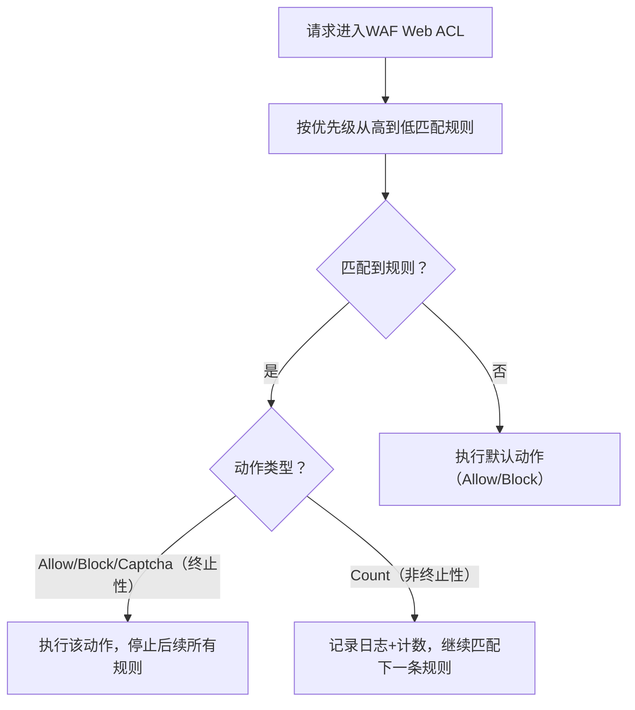

## 一、WAF规则执行的底层逻辑（必记）
### 1. 两个核心前提
- **规则优先级**：同一Web ACL中，规则按「数字越小，优先级越高」执行（比如优先级10的规则先于优先级20的规则）；
- **动作类型分类**：
  - 「终止性动作」：Allow、Block、Captcha（执行后**立即停止后续所有规则**，不再判断）；
  - 「非终止性动作」：Count（执行后**继续执行下一条规则**，仅记录日志）。

### 2. 执行顺序流程图（一目了然）

### 3. 你的问题直接验证：先Allow后Block的结果
如果规则配置如下：
| 规则优先级 | 规则内容                          | 动作类型 |
|------------|-----------------------------------|----------|
| 10（更高） | 允许IP段：192.168.0.0/24（办公网） | Allow    |
| 20（更低） | 拦截含SQL注入特征的请求           | Block    |

**结果**：来自192.168.0.0/24的请求，即使包含SQL注入特征，也会被**优先匹配Allow动作，直接放行**，后续的Block规则完全不执行！

### 关键原因：
Allow是「终止性动作」，只要匹配成功，WAF会立即停止所有后续规则的判断——无论后面有多少Block、Count规则，都不会生效。

## 二、真题示例（SAP考试高频题型）
### 真题1：单选题（规则优先级陷阱）
**题目**：某公司的WAF Web ACL配置了以下两条规则：
1. 优先级10：Allow（允许IP：10.0.0.0/8）
2. 优先级20：Block（拦截所有访问/admin路径的请求）

来自10.0.0.1的用户访问`https://example.com/admin`，该请求会被如何处理？  
A. 被Block（因为匹配/admin路径）  
B. 被Allow（因为优先匹配IP白名单）  
C. 先Count再Block  
D. 同时执行Allow和Block（冲突报错）

**答案**：B  
**解析**：优先级10的Allow规则先匹配，执行终止性动作，后续优先级20的Block规则不执行。

### 真题2：多选题（规则配置最佳实践）
**题目**：某Web应用需要实现“允许公司办公IP段访问所有路径，同时拦截其他IP访问/admin路径”，以下WAF规则配置正确的有？（多选）  
A. 优先级10：Allow（办公IP段），动作Allow  
B. 优先级20：Block（非办公IP+访问/admin），动作Block  
C. 优先级10：Block（非办公IP+访问/admin），动作Block  
D. 优先级20：Allow（办公IP段），动作Allow  

**答案**：AB  
**解析**：
- 正确逻辑：先放行白名单（高优先级Allow），再拦截非法请求（低优先级Block）；
- 错误选项CD：如果先Block后Allow，非办公IP访问/admin会被先Block，办公IP的Allow规则因优先级低无法生效，导致办公IP也无法访问/admin。

## 三、考试陷阱与最佳实践（必记）
### 1. 高频陷阱（避免踩坑）
- ❌ 误区1：“WAF会执行所有匹配的规则”→ 错！终止性动作（Allow/Block/Captcha）执行后，后续规则全停止；
- ❌ 误区2：“Block动作优先级高于Allow”→ 错！优先级只看配置的数字，与动作类型无关（数字越小越优先）；
- ❌ 误区3：“Count动作会影响后续规则”→ 错！Count是非终止性动作，仅记录，不影响后续规则执行。

### 2. 规则配置最佳实践（SAP实操题考点）
- **白名单优先**：Allow规则（如办公IP、信任IP）的优先级必须高于所有Block规则，避免白名单被误拦截；
- **先宽后严**：高优先级规则配置“大范围放行/拦截”（如IP白名单），低优先级规则配置“精细化过滤”（如路径拦截、攻击特征拦截）；
- **测试先行**：新配置的Block规则，先设为Count动作测试1-3天，确认无正常流量被误匹配后，再改为Block。

## 四、总结：核心口诀（秒杀规则执行题）
1. 优先级：数字越小越先执行；
2. 动作类型：终止（Allow/Block/Captcha）vs 非终止（Count）；
3. 执行逻辑：“终止动作一旦命中，后续规则全无用”；
4. 最佳实践：“白名单Allow放最前，Block规则跟后面，Count测试先验证”。