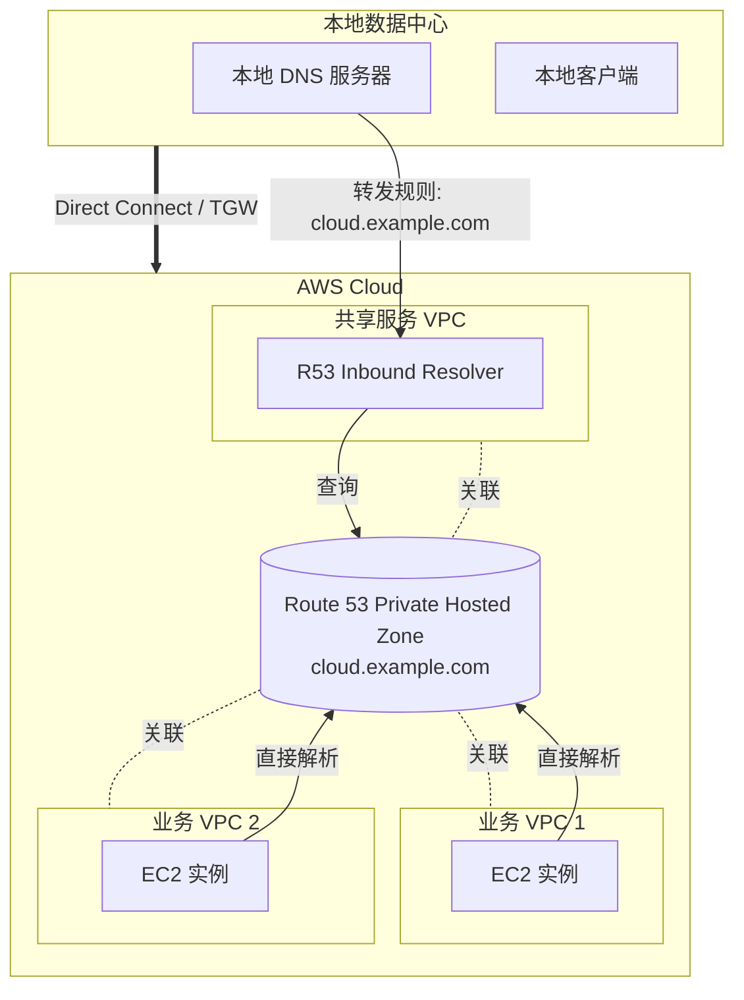

恭喜你，第一题就答对了！这道题非常经典，涵盖了 **AWS 混合网络 DNS 解析** 的核心场景。

下面是根据我们的“六步分析法”生成的详细解析：

#### 📝 [1/529] Route 53 Resolver 混合 DNS 架构

**1. 🕵️‍♂️ 题眼与约束分析**

  * **关键需求 1 (On-prem -\> AWS)：** 本地系统 (On-prem) 需要解析 VPC 内的 `cloud.example.com`。
      * *推论：* 必须有 **Inbound** (入站) 流量进入 AWS DNS 系统。
  * **关键需求 2 (AWS Internal)：** **所有** VPC 都应能够解析 `cloud.example.com`。
  * **关键限制：** **最高性能 (Highest Performance)**。
  * **现有设施：** Direct Connect (DX) + Transit Gateway (TGW)。

**2. ⚡ 秒杀思路**

  * **方向判断：** 题目明确要求“本地解析 AWS 域名”。
      * On-prem $\rightarrow$ AWS = **Inbound Endpoint (入站端点)**。
      * AWS $\rightarrow$ On-prem = **Outbound Endpoint (出站端点)**。
  * **秒杀动作：**
      * 看到“本地解析云端”，直接找 **Inbound Resolver**。排除 C (Outbound)。
      * 看到“最高性能/托管服务”，排除 B (EC2 是旧时代的自建方案，性能和维护都差)。
      * 剩下 A 和 D。区别在于 Private Hosted Zone (PHZ) 关联谁。为了性能，DNS 解析应该离源头最近，所以 PHZ 应该关联**所有** VPC，而非只关联共享 VPC。
      * **锁定 A。**

**3. ✅ 正确选项解析 (选项 A)**

  * **将 PHZ 关联到所有 VPC：** 这是利用 Route 53 的原生能力。每个 VPC 内部的实例在查询 `cloud.example.com` 时，直接通过 VPC 内部自带的 DNS 解析器（AmazonProvidedDNS，即 .2 地址）即可瞬间拿到结果，无需经过网络跳转，符合“最高性能”和“所有 VPC 都能解析”的需求。
  * **Inbound Resolver + 转发规则：** 这是处理混合云的标准姿势。本地 DNS 服务器不知道 AWS 的私有 IP，所以必须配置条件转发，将 `cloud.example.com` 的查询扔给 AWS 的 Inbound Resolver IP（位于共享 VPC 中，通过 DX/TGW 连通）。

**4. ❌ 错误选项排查**

  * **选项 B (EC2 条件转发器)：**
      * *错误原因：* 这是 Route 53 Resolver 发布之前的“原始人”做法。EC2 需要维护、打补丁，且不是高可用的托管服务，性能不如原生 Resolver。
  * **选项 C (Outbound Resolver)：**
      * *错误原因：* 方向反了。Outbound 是为了让 VPC 里的资源去解析本地企业内网域名的（例如 AWS $\rightarrow$ `corp.local`）。
  * **选项 D (PHZ 仅关联共享 VPC)：**
      * *错误原因：* 如果 PHZ 只关联了共享 VPC，其他 VPC 里的 EC2 默认是无法解析 `cloud.example.com` 的。要实现解析，其他 VPC 必须将 DNS 查询转发给共享 VPC，这会产生额外的网络跳数（Latency），不仅配置复杂，且违反了“最高性能”原则（也就是没必要的网络折腾）。

**5. 📚 核心考点与延伸 (Bonus)**

  * **本题考察点：** Route 53 Resolver (Inbound Endpoint) 的使用场景，以及 Private Hosted Zone 的关联机制。
  * **干扰项设计意图：** 选项 D 是典型的干扰项。它诱导你认为通过 TGW 把大家连起来就能自动解析 DNS，但实际上 **网络连通性 $\neq$ DNS 解析能力**。DNS 解析范围是由 PHZ 关联（Association）决定的。

**6. 架构图**

-----

**小结：**
这题只要记住 **"On-prem to AWS = Inbound"** 和 **"PHZ 尽量多关联"** 两个原则，基本可以秒杀。

准备好下一题了吗？请发送！