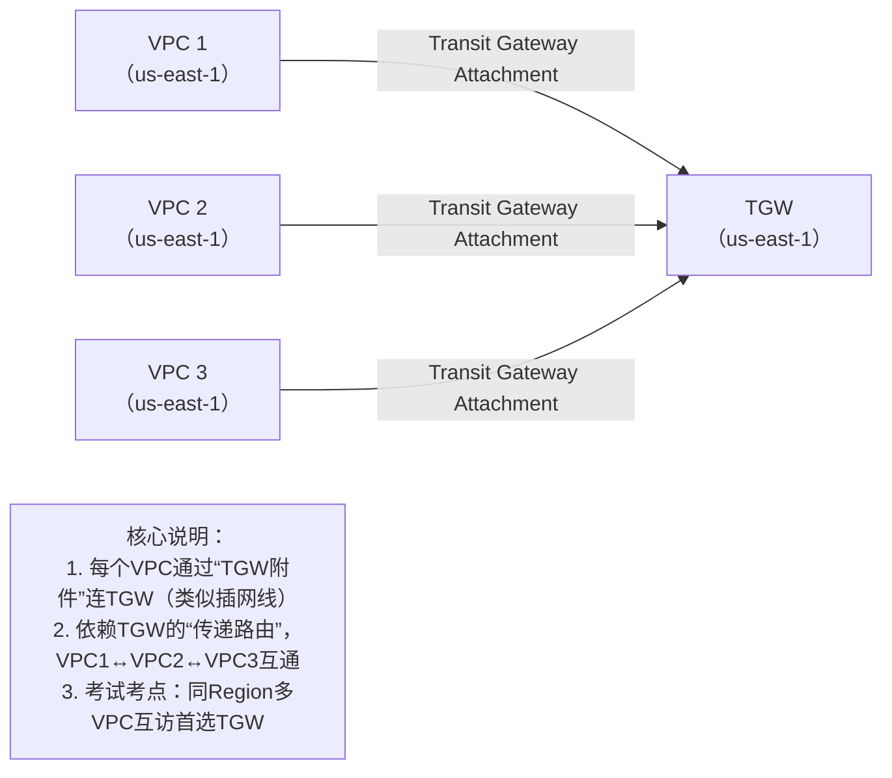
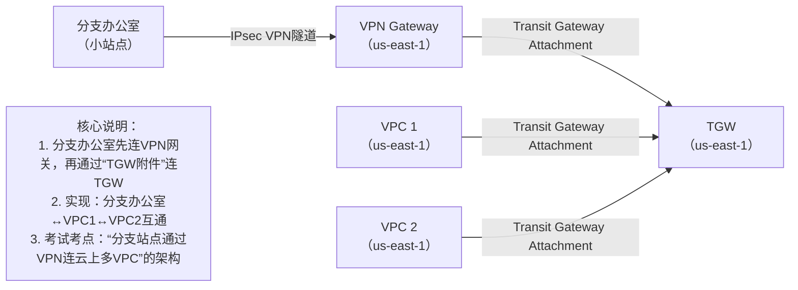
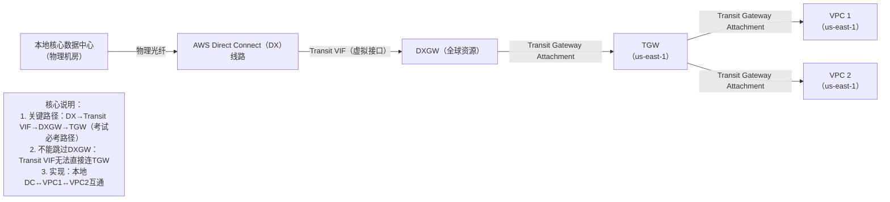
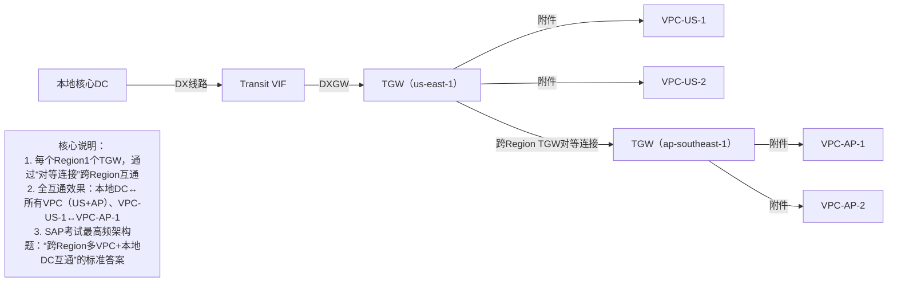

# 三个核心问题深度解答（含架构图+考点关联）

## 一、核心问题1：跨Region多VPC+本地DC互通，是否只能用TGW？
### 结论：**首选且SAP考试默认“最优解”是TGW方案**，但不是“唯一解”（其他方案有局限，考试不考）
### 详细拆解：
1. 你的核心思路完全正确！  
   当需要满足「跨Region多VPC互通 + 本地DC与所有VPC互通」时，**TGW是唯一能高效实现的方案**，架构逻辑就是：  
   `每个Region部署1个TGW` → 「本地DC→DX→DXGW→其中一个Region的TGW」 → 「各Region TGW通过「跨Region TGW对等连接（TGW Peering）」互通」 → 「所有VPC通过“TGW附件（Attachment）”连到本Region TGW」

2. 为什么不能用其他方案？（SAP考试“排除法”考点）  
   - 用DXGW：只能实现「本地DC→跨Region VPC」，但VPC间不能互通（无传递路由），满足不了核心需求；  
   - 用VPC对等连接：跨Region多VPC（比如10个）需要建立45个对等连接（N*(N-1)/2），管理复杂，且本地DC无法通过对等连接连所有VPC，完全不适合生产环境（考试会问“多Region多VPC互通，最推荐的方案是？”，直接排除对等连接）。

3. 补充：是否“必须”每个Region一个TGW？  
   是！因为**TGW是Region级资源**（比如us-east-1的TGW不能直接连eu-west-1的VPC），所以每个Region的VPC必须先连到本Region的TGW，再通过跨Region TGW对等实现互通。

### 该方案的SAP考试关键词：
- 正确选项：“跨Region TGW对等连接”“每个Region部署TGW”“本地DC通过DXGW连TGW”；  
- 错误选项：“跨Region VPC通过DXGW互访”“用VPC对等连接实现跨Region多VPC互通”。

## 二、核心问题2：TGW的4种“万能连接”架构图（含数据流向）
用「Mermaid架构图+文字说明」呈现，每个图都标注「考试重点」，方便你记忆和做题时对应：

### 架构图1：VPC连TGW（同Region多VPC互通）

### 架构图2：Site-to-Site VPN连TGW（分支办公室连云上资源）

### 架构图3：DX（本地核心DC）连TGW（SAP经典架构）

### 架构图4：跨Region TGW对等连接（多Region+本地DC全互通）

## 三、核心问题3：DX的VIF类型与VLAN的关系（SAP选择题考点）
### 结论：**每个VIF（不管是Private、Public、Transit）都必须对应一个唯一的VLAN ID**
### 详细拆解（新手友好版）：
1. 先明确两个基础概念：
   - VIF（Virtual Interface）：DX线路上的“虚拟接口”——你可以把DX想象成一根“物理光纤（高速公路）”，VIF就是这根公路上的“不同车道”，每个车道负责一种流量（比如连VGW、连DXGW、连AWS公网服务）；
   - VLAN（Virtual LAN）：用于“区分同一物理线路上的不同流量”——就像给每个“车道”贴一个唯一的标签，确保流量不会混在一起（比如Private VIF的流量和Transit VIF的流量不会互相干扰）。

2. 为什么每个VIF都需要唯一VLAN？
   - 技术层面：DX线路是“共享物理链路”，AWS和你的本地DC设备（路由器）需要通过VLAN ID来识别“这个流量属于哪个VIF”，从而转发到正确的目标（比如VGW、DXGW）；
   - 考试层面：真题会直接问“下列关于DX VIF的说法正确的是？”，选项“每个VIF对应唯一VLAN ID”是正确答案，“多个VIF可以共用一个VLAN ID”是错误选项。

3. 三种VIF的VLAN用途（结合之前的网关，形成知识闭环）：
| VIF类型   | 核心用途                  | 对应VLAN的作用                          | 关联的网关       |
|-----------|---------------------------|-----------------------------------------|------------------|
| Private VIF | 本地DC连单个VPC（通过VGW） | 区分不同VPC的Private VIF流量（比如VPC1和VPC2的Private VIF用不同VLAN） | VGW              |
| Public VIF  | 本地DC访问AWS公网服务（如S3、EC2公网IP） | 区分“公网流量”和其他流量（比如Private VIF的流量） | 无（直接连AWS公网） |
| Transit VIF | 本地DC连TGW（通过DXGW）   | 区分“连DXGW的Transit VIF流量”和其他VIF流量 | DXGW（再连TGW）  |

### 考试陷阱提醒：
- 错误选项：“Transit VIF不需要VLAN ID”“Private VIF和Transit VIF可以共用VLAN ID”；
- 正确选项：“每个DX VIF必须配置唯一的VLAN ID（范围：1-4094）”“Transit VIF的VLAN用于识别连DXGW的流量”。

## 四、SAP备考总结（新手必记）
1. 跨Region多VPC+本地DC互通：**首选TGW方案**（每个Region1个TGW+跨Region对等连接），这是考试“唯一正确答案”；
2. TGW的4种连接架构：重点记「DX→Transit VIF→DXGW→TGW」和「跨Region TGW对等」，这两个是架构题高频考点；
3. VIF与VLAN：记住“一对一”关系，三种VIF的用途要和网关（VGW/DXGW/TGW）对应起来，做题时快速排除错误选项。