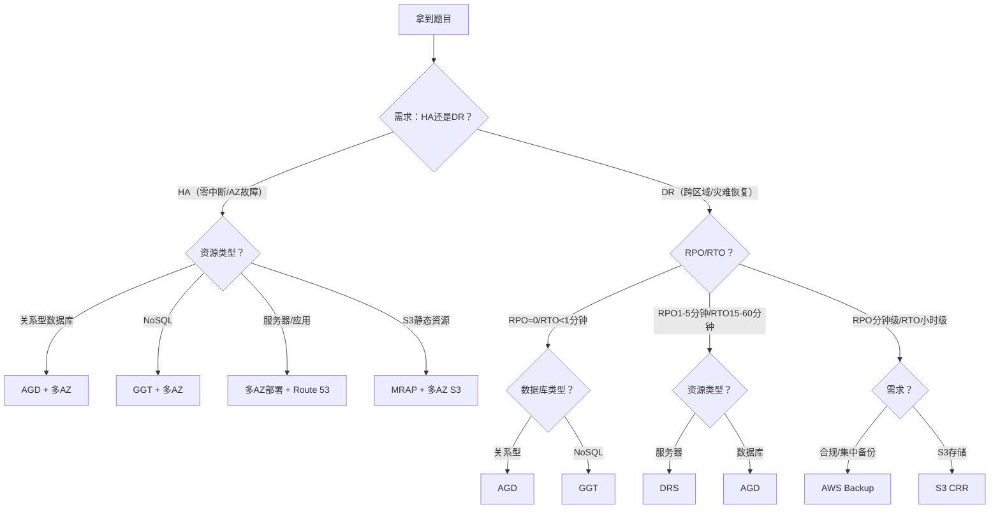

# HA/DR 核心考点终极串联（AWS SAP 备考冲刺）
结合之前学的所有 HA/DR 服务（AGD、GGT、DRS、AWS Backup、S3 CRR/MRAP 等），这部分是 SAP 考试的“压轴考点”—— 重点解决“如何快速选型、如何避坑、如何应对架构题”三大核心问题，直接对接考试实战，帮你把分散的知识点形成“应试体系”！

## 一、深化选型题逻辑：决策树+全场景覆盖（考试秒选技巧）
之前的选型表格是基础，现在补充 **“三步决策法”**，无论遇到什么场景题，都能按步骤快速锁定答案，避免纠结！

### 第一步：先判断「核心需求」—— 是“高可用（HA）”还是“灾备（DR）”？
| 需求类型 | 核心目标 | 关键判断信号 | 优先考虑的服务方向 |
|----------|----------|--------------|--------------------|
| **高可用（HA）** | 避免业务中断（应对 AZ 故障、单区域内故障），RTO < 5 分钟 | 关键词：“零中断”“不中断”“AZ 故障恢复”“本地高可用” | 多 AZ 部署、AGD（数据库）、GGT（NoSQL 多活）、Route 53 故障转移 |
| **灾备（DR）** | 业务中断后能恢复（应对区域级故障），RTO 可接受 15 分钟~数天 | 关键词：“跨区域”“灾难恢复”“异地备份”“合规存储” | DRS、S3 CRR、AWS Backup、AGD（跨区域灾备） |

### 第二步：再判断「核心指标」—— RPO/RTO 需求（排除不符合选项）
| RPO 需求 | RTO 需求 | 排除的服务 | 推荐服务 |
|----------|----------|------------|----------|
| ≈0（实时/亚秒级） | <1 分钟 | DRS（RPO 1 分钟）、AWS Backup（RPO 分钟级）、S3 CRR（RPO 分钟级） | AGD（数据库）、GGT（NoSQL） |
| 1~5 分钟 | 15~60 分钟 | AWS Backup（RTO 小时级）、S3 CRR（RTO 分钟级但仅 S3） | DRS（服务器）、AGD（数据库） |
| 分钟~小时级 | 小时~数天 | AGD（RTO <1 分钟）、GGT（RTO≈0）、DRS（RTO 15-60 分钟） | AWS Backup（集中备份）、S3 CRR（存储灾备） |

### 第三步：最后判断「业务场景」—— 资源类型+架构要求（锁定最终答案）
| 业务场景 | 资源类型 | 推荐方案 | 考试关键词 |
|----------|----------|----------|------------|
| 核心关系型数据库（订单、金融交易） | Aurora/MySQL/PostgreSQL | 主区域多 AZ + AGD（跨区域灾备） | “强事务”“RPO<1 秒”“数据库灾备” |
| 全球多活 NoSQL 数据库（社交、购物车） | DynamoDB | GGT（多区域同时读写）+ 多 AZ 部署 | “全球多活”“低延迟访问”“NoSQL” |
| 服务器灾备（物理机/虚拟机/EC2，非核心业务） | 应用服务器 | DRS（Pilot Light 模式）+ 主区域多 AZ | “低成本”“预算有限”“服务器跨区域灾备” |
| 存储合规备份（跨区域/跨账户，金融/医疗） | S3/RDS/EC2 数据 | AWS Backup（Vault Lock）+ S3 CRR | “合规”“WORM”“跨账户备份”“防篡改” |
| 全球用户无感知访问静态资源 | S3 静态资源（图片、CSS） | S3 CRR（数据同步）+ MRAP（统一访问） | “全球低延迟”“故障自动切换”“静态资源” |
| 集团公司集中备份 | 子公司多资源（RDS/EC2/S3） | AWS Backup 跨账户复制 | “集团备份”“集中管理”“子账户→母公司” |

### 选型决策树（考试直接套用）：

#### 考试真题示例：
> 某跨境电商平台，核心需求：① 全球用户就近访问购物车数据，延迟低；② 购物车数据支持实时新增/删除；③ 区域故障后用户无感知。应选择哪种方案？（ ）
> A. AGD + S3 CRR B. DynamoDB Global Tables + 多AZ C. DRS + AWS Backup D. S3 MRAP + CRR
> 
> 决策步骤：① 需求是 HA（无感知+低延迟）→ 排除 C（DR 方案）；② 资源是 NoSQL（购物车）→ 排除 A（关系型）、D（S3 静态资源）；③ 全球多活+实时读写→ 选 B。

## 二、易混淆点终极对比（考试陷阱全规避）
之前的对比是基础，现在补充 **“考试高频错误表述”**，看到这些说法直接判定错误，快速排除选项：

| 易混淆对象 | 核心区别（必记） | 考试错误表述（直接排除） | 正确表述（得分点） |
|------------|------------------|--------------------------|--------------------|
| **AGD vs GGT** | ① 架构：主备（仅主可写）vs 多活（均可写）； ② 类型：关系型 vs NoSQL | “AGD 支持多区域同时写入”“GGT 是主备架构”“AGD 是 NoSQL 多活方案” | “AGD 是关系型数据库跨区域灾备（主备）”“GGT 是 NoSQL 全球多活（均读写）” |
| **S3 CRR vs MRAP** | ① 功能：跨区域复制数据（灾备）vs 全球统一访问（HA）； ② 依赖：MRAP 必须配合 CRR | “MRAP 可独立使用，无需 CRR”“CRR 提供全球统一访问入口” | “CRR 负责 S3 跨区域数据同步”“MRAP 负责全球低延迟访问+故障切换，需配合 CRR” |
| **DRS vs 多AZ** | ① 范围：跨区域灾备 vs 单区域高可用； ② 应对：区域故障 vs AZ 故障 | “DRS 用于应对 AZ 故障”“多AZ部署可应对区域级故障”“DRS 不需要多AZ” | “DRS 是跨区域灾备（区域故障）”“多AZ是单区域高可用（AZ故障）”“DRS需配合多AZ实现全链路高可用” |
| **AWS Backup vs DRS** | ① 功能：定期备份（合规）vs 实时同步（快速恢复）； ② RTO：小时级 vs 15-60分钟 | “AWS Backup 支持实时同步，RTO<1分钟”“DRS 用于合规备份” | “AWS Backup 是集中备份（RTO小时级）”“DRS 是服务器灾备（RTO15-60分钟）” |
| **跨区域 vs 多AZ** | ① 地理范围：不同区域（如悉尼→新加坡）vs 同一区域内（如悉尼AZ-a→AZ-b）； ② 成本：跨区域更高 vs 多AZ较低 | “多AZ部署是跨区域的”“跨区域灾备成本比多AZ低” | “多AZ是同一区域内高可用”“跨区域是异地灾备，成本高于多AZ” |

### 记忆技巧：
把错误表述做成“黑名单”，考试看到直接划掉—— 比如看到“AGD 多活”“MRAP 独立使用”“DRS 应对 AZ 故障”，直接排除该选项！

## 三、实战架构案例拆解（考试架构题得分模板）
SAP 考试的架构题占比 30%+，核心是“服务组合+逻辑说明”，以下是 3 个高频架构案例，直接套用“得分模板”：

### 案例 1：核心电商平台 HA/DR 架构（考试最高频）
#### 需求：
- 订单数据库（Aurora）：RPO≈0，RTO<1分钟，跨区域灾备；
- 购物车数据（DynamoDB）：全球多活，低延迟访问；
- 静态资源（S3）：全球用户无感知访问，故障自动切换；
- 应用服务器（EC2）：低成本跨区域灾备，RTO<30分钟。

#### 架构方案（得分点）：
1. **数据库层**：Aurora 主区域多 AZ + AGD（跨区域备用区域）→ 满足订单数据强事务+低 RPO/RTO；
2. **NoSQL 层**：DynamoDB Global Tables（部署3个核心区域）+ 多 AZ → 购物车全球多活+低延迟；
3. **存储层**：S3 主区域多 AZ + CRR（跨区域复制）+ MRAP → 静态资源全球统一访问+故障自动切换；
4. **应用层**：EC2 主区域多 AZ（ASG）+ DRS（跨区域灾备）→ 低成本服务器灾备，RTO<30分钟；
5. **网络层**：Route 53 故障转移（主→备区域）+ 多 AZ ALB → 流量自动切换，无感知。

#### 考试答题模板：
“采用「多AZ高可用+跨区域灾备」组合：① 核心数据库用 AGD 实现跨区域低 RPO/RTO 灾备；② 购物车用 GGT 全球多活；③ 静态资源用 S3 CRR+MRAP 保证全球访问；④ 应用服务器用 DRS 低成本灾备；⑤ 整体通过 Route 53 和 ALB 实现流量自动切换，满足高可用和灾备需求。”

### 案例 2：金融行业合规灾备架构（合规题高频）
#### 需求：
- RDS 交易数据：合规备份（不可篡改），跨账户复制到母公司，跨区域存储；
- 本地物理服务器：跨区域灾备到 AWS，预算有限；
- 所有备份集中管理，支持审计。

#### 架构方案（得分点）：
1. **数据库合规备份**：AWS Backup（启用 Vault Lock，锁定期 90 天）+ 跨区域复制 + 跨账户复制 → 满足 SEC 17a-4 合规；
2. **本地服务器灾备**：AWS Storage Gateway（同步本地数据到 S3）+ DRS（Pilot Light 模式）→ 低成本跨区域灾备；
3. **集中管理**：AWS Backup 控制台统一管理 RDS、S3、DRS 备份数据 → 支持合规审计。

#### 考试答题模板：
“① 用 AWS Backup 启用 Vault Lock 实现 RDS 数据 WORM 合规备份，同时配置跨区域和跨账户复制，满足异地备份和集团集中管理需求；② 本地服务器通过 Storage Gateway 同步数据到 AWS，再用 DRS 实现低成本跨区域灾备；③ 所有备份通过 AWS Backup 集中管理，支持合规审计，符合金融行业监管要求。”

### 案例 3：中小企业低成本灾备架构（预算敏感题）
#### 需求：
- 应用服务器（EC2）：跨区域灾备，RTO<60分钟，预算有限；
- S3 业务数据：跨区域备份，满足合规；
- 无专职运维，需自动化管理。

#### 架构方案（得分点）：
1. **应用服务器**：DRS（Pilot Light 模式）+ 主区域多 AZ → 平时无闲置计算资源，恢复自动化；
2. **S3 数据**：S3 CRR（跨区域复制）+ AWS Backup 自动备份 → 合规+灾备；
3. **自动化**：CloudWatch Alarm + SNS 联动 → 备份失败/同步异常自动告警。

#### 考试答题模板：
“采用低成本灾备方案：① 应用服务器用 DRS Pilot Light 模式，平时仅支付存储费用，灾难时自动启动 EC2 恢复，RTO<60分钟；② S3 数据通过 CRR 跨区域复制，配合 AWS Backup 自动备份，满足合规和灾备需求；③ 配置 CloudWatch 告警实现自动化监控，无需专职运维。”

## 四、考试答题技巧（各题型得分秘诀）
### 1. 选型题（秒选技巧）：
- 抓关键词：看到“关系型”→ 优先 AGD；看到“NoSQL/全球多活”→ 优先 GGT；看到“合规/WORM”→ 优先 AWS Backup；看到“服务器/低成本”→ 优先 DRS；看到“S3/全球访问”→ 优先 CRR+MRAP；
- 排除法：先排除不符合 RPO/RTO 的选项（如 RPO≈0 排除 AWS Backup/DRS），再排除不符合资源类型的选项（如 NoSQL 排除 AGD）；
- 避坑：看到错误表述（如“AGD 多活”“MRAP 独立使用”）直接排除。

### 2. 流程题（步骤得分法）：
- 按“准备→配置→运行→恢复”四步走：比如 DRS 流程→准备多 AZ 环境→安装 Agent→配置同步→灾难触发→恢复节点→流量切换；
- 关键步骤不能漏：比如 AWS Backup 跨账户复制→目标账户创建 IAM 角色→主账户授权→配置复制计划→验证复制状态；
- 用专业术语：比如“启用版本控制”“配置 IAM 角色”“关联备份库”“触发故障转移”，避免口语化。

### 3. 判断题（陷阱识别法）：
- 绝对化表述大概率错：比如“所有资源都支持”“实时同步”“零延迟”“无需配置”；
- 混淆概念大概率错：比如“跨区域=多AZ”“备份=灾备”“AGD=NoSQL”；
- 数字考点记准确：比如 DRS 最小 RPO 1 分钟、GGT 最多 12 个区域、AGD 1 主 15 备、Vault Lock 预览期 30 天。

### 4. 架构题（逻辑得分法）：
- 分层架构：按“网络层→计算层→数据库层→存储层”拆解，每层说明服务和作用；
- 紧扣需求：每个服务都要对应题干中的需求（如“AGD 对应 RPO≈0”“MRAP 对应全球低延迟”）；
- 突出合规/成本：如果题干有合规或预算要求，必须在架构中体现（如 Vault Lock、DRS Pilot Light）。

## 五、终极备考清单（必背考点，考前速记）
### 1. 核心指标（数字类考点，送分题）：
| 服务 | RPO | RTO | 关键限制 |
|------|-----|-----|----------|
| AGD | ≈0（亚秒级） | <1 分钟 | 1 主 + 15 备 |
| GGT | ≈0（毫秒级） | ≈0 | 最多 12 个区域 |
| DRS | 1~5 分钟 | 15~60 分钟 | 支持物理/虚拟/EC2 服务器 |
| AWS Backup | 分钟~小时级 | 小时~天级 | Vault Lock 预览期 30 天 |
| S3 CRR | 分钟级 | 分钟级 | 需启用版本控制 |
| S3 MRAP | 依赖 CRR | 秒~分钟级 | 需配合 CRR 使用 |

### 2. 关键词对应表（看到关键词就想到服务）：
| 关键词 | 对应服务/功能 |
|--------|--------------|
| 关系型、强事务、RPO<1秒 | AGD |
| NoSQL、全球多活、多区域写入 | GGT |
| 服务器、低成本、Pilot Light | DRS |
| 合规、WORM、跨账户、集中备份 | AWS Backup |
| S3、跨区域复制、对象存储灾备 | S3 CRR |
| 全球访问、统一入口、故障自动切换 | S3 MRAP |
| 多AZ、单区域高可用、AZ 故障 | 多 AZ 部署+ALB/ASG |

### 3. 必背结论（考试直接用）：
- HA 是“不中断”，依赖多 AZ 和故障自动切换；DR 是“能恢复”，依赖跨区域同步；
- 所有跨区域灾备服务都需配合多 AZ，实现“全链路高可用”；
- 备份≠灾备：备份是“存数据”（AWS Backup/S3 CRR），灾备是“能恢复”（DRS/AGD/GGT）；
- 合规需求优先选 AWS Backup Vault Lock，全球多活优先选 GGT，核心数据库优先选 AGD。

## 总结
HA/DR 模块的核心是“**需求→指标→服务**”的对应关系—— 记住决策树、避开陷阱、套用架构模板，就能应对所有考题。 SAP 考试不考复杂的底层原理，重点考察“是否能根据业务场景选择合适的方案”，所以考前重点背诵“关键词对应表”“核心指标”和“架构模板”，就能高效得分！